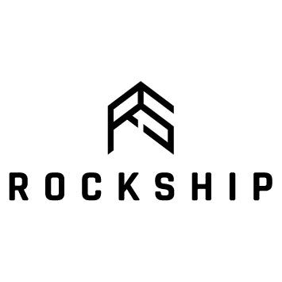

Hi  I'm Meng Han
====================================================================================================================================

<h3 align="left">💾 Currently pursuing a Master of Science in Data Science & Machine Learning at NUS</h3>
<h3 align="left">💻 Bachelor of Engineering (Computer Engineering) graduate from NUS</h3>
<h3 align="left">🎮  Aspiring AI / ML & Cloud Engineer </h3>

* 🌍  Based in Singapore
* ✉️  You can contact me at [yeomenghan1989@gmail.com](mailto:yeomenghan1989@gmail.com)
* 🧠  Currently pursuing my AWS Certification
* 🤝  I'm open to collaborating on AI-related applications

### Socials

 <a href="https://www.github.com/yeo-menghan" target="_blank" rel="noreferrer"> <picture> <source media="(prefers-color-scheme: dark)" srcset="https://raw.githubusercontent.com/danielcranney/readme-generator/main/public/icons/socials/github-dark.svg" /> <source media="(prefers-color-scheme: light)" srcset="https://raw.githubusercontent.com/danielcranney/readme-generator/main/public/icons/socials/github.svg" />  </picture> </a> <a href="https://www.linkedin.com/in/yeo-meng-han" target="_blank" rel="noreferrer"> <picture> <source media="(prefers-color-scheme: dark)" srcset="https://raw.githubusercontent.com/danielcranney/readme-generator/main/public/icons/socials/linkedin-dark.svg" /> <source media="(prefers-color-scheme: light)" srcset="https://raw.githubusercontent.com/danielcranney/readme-generator/main/public/icons/socials/linkedin.svg" />  </picture> </a>

### Skills

<table style="width:100%; table-layout:fixed; border-collapse:collapse;">
  <tr>
    <td colspan="10" style="padding-bottom:10px;">
      <h3 style="margin:0; padding:0;">Languages, Frameworks and Tools</h3>
    </td>
  </tr>
  <tr>
    <td align="center">
      
    </td>
    <td align="center">C</td>
    <td align="center">
      
    </td>
    <td align="center">C++</td>
    <td align="center">
      
    </td>
    <td align="center">Git</td>
    <td align="center">
      
    </td>
    <td align="center">Java</td>
    <td align="center">
      
    </td>
    <td align="center">Python</td>
  </tr>
  <tr>
    <td align="center">
      
    </td>
    <td align="center">JavaScript</td>
    <td align="center">
      
    </td>
    <td align="center">TypeScript</td>
    <td align="center">
      
    </td>
    <td align="center">React</td>
    <td align="center">
      
    </td>
    <td align="center">Vite</td>
    <td align="center">
      
    </td>
    <td align="center">NodeJS</td>
  </tr>
  <tr>
    <td align="center">
      
    </td>
    <td align="center">Flask</td>
    <td align="center">
      
    </td>
    <td align="center">SQL</td>
     <td align="center">
      
    </td>
    <td align="center">TensorFlow</td>
    <td align="center">
      
    </td>
    <td align="center">PyTorch</td>
    <td align="center">
      
    </td>
    <td align="center">Pandas</td>
  </tr>
  <tr>
    <td align="center">
      
    </td>
    <td align="center">Figma</td>
    <td align="center">
      
    </td>
    <td align="center">WordPress</td>
    <td align="center">
      
    </td>
    <td align="center">Arduino</td>

  </tr>
</table>

<h3 align="left">Internship Experiences</h3>

<table align="left">
  <tr>
    <th style="text-align: center;">2025 Summer</th>
    <th style="text-align: center;">2025</th>
    <th style="text-align: center;">2024</th>
    <th style="text-align: center;">2023 Summer</th>
  </tr>
  <tr>
    <td align="center">
       
    </td>
    <td align="center">
       
    </td>
    <td align="center">
       
    </td>
    <td align="center">
       
    </td>
  </tr>
  <tr>
    <td style="text-align: center;">Machine Learning Engineer Intern</td>
    <td style="text-align: center;">Computer Vision Research Assistant</td>
    <td style="text-align: center;">AI / ML & Computer Vision Engineer Intern</td>
    <td style="text-align: center;">Robotics Engineer Intern</td>
  </tr>
</table>
